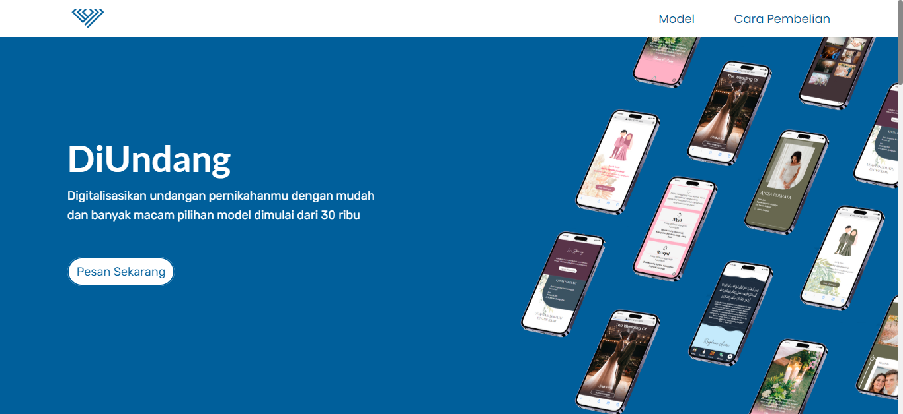

<p align="center"><strong>Website Undangan Digital - diundang</strong></p>
<p align="center"><sub>Laravel Livewire</sub></p>
<p align="center"><sub>Jangan lupa tekan 🌟</sub></p>

## Langkah untuk menggunakan Website Undangan Digital - diundang

1. ```git clone https://github.com/insanXYZ/Website-Undangan-Digital.git```
2. ```cd Website-Undangan-Digital```
3. ```composer install```
4. ```php artisan storage:link```
5. export file wedding.sql ke database
6. ```php artisan serve```

## Daftar Route diundang

Berikut adalah daftar route yang tersedia dalam proyek Laravel ini:

| Method       | URI                                     |
|:-------------|:----------------------------------------|
| GET|HEAD     | /                                       |
| GET|HEAD     | area51                                  |
| POST         | area51                                  |
| GET|HEAD     | dashboard                               |
| GET|HEAD     | dashboard/create                        |
| POST         | dashboard/create                        |
| GET|HEAD     | dashboard/manage                        |
| DELETE       | dashboard/manage/{slug}                 |
| GET|HEAD     | dashboard/manage/{slug}/edit            |
| PATCH        | dashboard/manage/{slug}/edit            |
| POST         | logout                                  |
| GET|HEAD     | {slug}                                  |
| POST         | {slug}                                  |

**Catatan:**
- `GET|HEAD` artinya route dapat diakses menggunakan metode HTTP GET atau HEAD.
- `URI` adalah bagian dari URL yang mengidentifikasi route.
- `/area51` tidak ada button atau anchor menuju kesana di tampilan web dikarenakan untuk keamanan, oleh karena itu untuk mengakses nya cukup menambahkan URI tersebut ke bagian akhir di url.

## Penggunaan di dashboard diundang

1. Masuk ke halaman ```/area51``` untuk login.
2. Login dengan username " admin@gmail.com " dan password "password"
3. Pada bagian **home** akan terlihat ada berapa postingan dan komentar yang telah dibuat
4. **Manage Postingan** berisikan seluruh postingan yang telah dibuat dan disana terdapat aksi untuk Read, Update, dan delete.
5. **Tambah Postingan** berfungsi untuk menambahkan postingan
